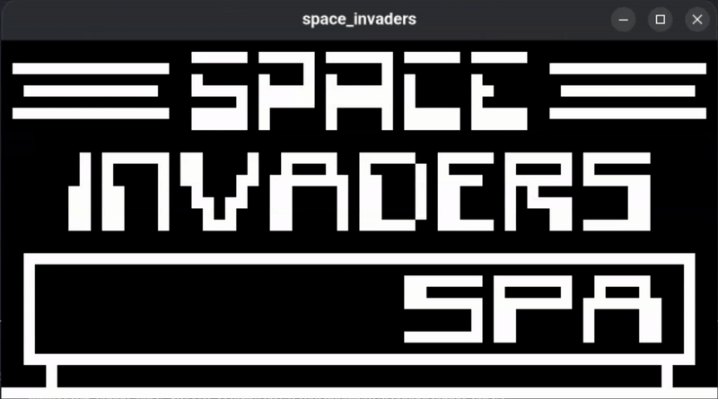

# capp8

**capp8** is a simple and educational Chip-8 emulator written in Rust. It aims to provide a clean and modular codebase for learning and experimenting with emulator development.



---

## Features

- Full support for the original Chip-8 instruction set
- Modular architecture with separate core and UI layers
- Cross-platform desktop support
- Simple keyboard input handling
- Monochrome graphics rendering
- ROM loading from the `roms/` directory

---

## Getting Started

### Prerequisites

- [Rust](https://www.rust-lang.org/tools/install) (latest stable version recommended)

### Build & Run

```bash
git clone https://github.com/Haislich/capp8.git
cd capp8
cargo run --release
```
